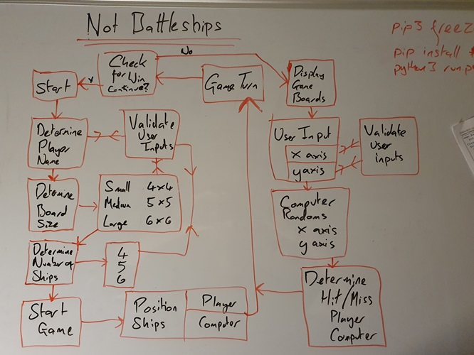
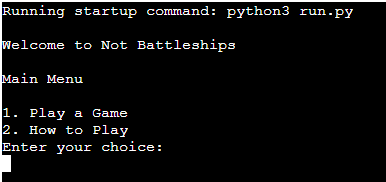
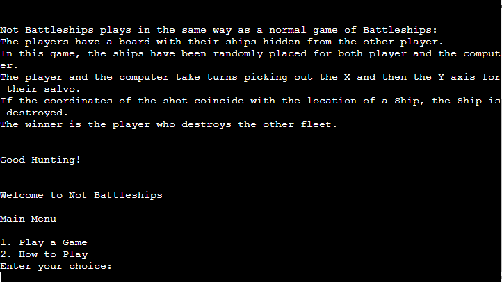

# [Not Battleships](https://boderg.github.io/your-weather "Click to view the deployed site")

- Not Battleships is a simple game based on the board game Battleships
- Not Battleships has been designed so that any user of any age can can use it
- Not Battleships is designed so that it can present different sizes of board.
- Not Battleships displays both the player board and the computer's board, but with the ships hidden.
- Not Battleships has the option of how many ships the player would like to have on the board.

## Table of Contents

Click here for Table of Contents

[Mockup Screenshots](#mockup-screenshots)

[UX](#ux)

- [Colour Scheme](#colour-scheme)
- [Typography](#typography)

[User Stories](#user-stories)

- [New site Users](#new-site-users)
- [Returning Site Users](#returning-site-users)

[Flow](#flow)

[Features](#features)

- [Existing Features](#existing-features)
- [Future Features](#future-features)

[Testing](#testing)

[Credits](#credits)

- [Content and Code](#content-and-code)

- [Acknowledgments](#acknowledgements)

## Mockup Screenshots

Below are two mockup images of the Your Weather website created using the "Am I Responsive" website.

| Screenshot 1 | Screenshot 2 |
| :---: | :---: |
|  |  |

## UX

- The design for Your Weather was created as a series of wireframes covering mobile, tablet and desktop to determine the initial design and layout of the site.
- Your Weather site was designed with ease of use and simplicity in mind.
- A simple clean look was built so that all a user needs to do is enter their town or city name and click search.

### Colour Scheme

- Colour scheme is limited to a black background and white text.

### Typography

- The Typography is limited to the terminal font used within the basic Heroku utility.

## User Stories

Sadly, I haven't had the chance to get any actual feedback from friends and / or family.  But this is what I'm hoping they would tell me:

### New Site Users

- As a new site user, I would like to have a main menu.
- As a new site user, I would like to know how to play the game.
- As a new site user, I would like to clear instructions throughout the game.

### Returning Site Users

- As a returning site user, I would like to choose the size of the map.
- As a returning site user, I would like to choose how many ships each side plays with.

## Flow

In order to figure out the order of how the program was going to be organised a flow diagram was produced.

| Flow Diagram |
| :---: |
|  |

## Features

### Existing Features

| Feature | Description | Screenshot |
| :---: | :---: | :---: |
| **Game Menu** | The Program required an introduction screen that offers the options to play or get instructions. |  |
| **Instructions** | I simple outline of the game and how to win and how to play. |  |
| **City Input Box** | The 'City Input Box' is where the user can input their town or city name for which the site can then generate the details from. |  |
| **Search Button** | The 'Search Button' is available so that the user can can confirm their town or city input and the site will search for the weather of that town or city, this is especially needed for mobile devices where there is no enter key. |  |
| **Metric / Imperial Toggle** | The 'Metric / Imperial Toggle' is for users who prefer their weather data in the format they are most used to, e.g. Europe - Metric / U.S. - Imperial. |   |
| **Footer** | The footer contains a link to the creators GitHub along with the project details. |  |

### Future Features

- Traditional Ship Sizes
  - A feature that adds the original ships and their sizes to the game
- Add directions for the ships
  - Allow the original ships to be based on a horizontal or vertical axxis
- More player options
  - Allow the player to place their own ships

## Tools & Technologies Used

- [Python](https://www.python.org/) used for the main program content.
- [Git](https://git-scm.com) used for version control. (`git add`, `git commit`, `git push`)
- [GitHub](https://github.com) used for secure online code storage.
- [Heroku](https://www.heroku.com) used for hosting the deployed front-end site.
- [Pi] (https:/www.pi.ai/talk) used for finding faults with syntax and indentation.

## Testing

Testing required a LOT of trying to run through the code.  The issues came up in the following places:
- Positioning of ships: positioning the ships started out so that all ships were visible for testing
- position of computer ships: once the testing was completed the computer ships had to be hidden.
- A running problem was displaying the boards, determining the empty cells and those that had ships present
- the solution to having hidden ships was ultimately to have two computer boards, one specifically being VISIBLE
- validation for the player's name: it is the only part of the game that actually takes a string response
- validation was made more clear after speaking with my mentor; what could a user potentially input instead of what is expected.
- the player's turn: having to remember that the shot needed to be recorded to the computer's VISIBLE game board
- creating turns that would allow the game to recognise the wining conditions without useing a score.

## Deployment

The site was deployed to Heroku.

- In the [Heroku](https://dashboard.heroku.com/apps/notbattleships/deploy/github)

## Credits

The following are credits to various people and technologies that have directly or otherwise assisted in the creation of the Not Battleships game.

### Content and Code

| Source | Location | Notes |
| --- | --- | --- |
| [Python.org](https://www.python.org) | Research | further understaning of paython functions and validation |
| [YouTube](https://www.youtube.com/watch?v=WZNG8UomjSI&t=1783s) | Research | a LOT of python coding techniques |
| [Stack Overflow](https://stackoverflow.com/) | Research | additional Python research |
| [Medium](https://medium.com/) | Research | additional Python research |
| [She Codes](https://shecodes.io/) | Research | additional Python research |
| [Geeks for Geeks](https://geeksforgeeks.org/) | Research | additional Python research |
| [Pi](https:/www.pi.ai/talk) | Validation | additional Python research and checking for syntax and indentation faults |

### Acknowledgements

- I would like to thank my Code Institute mentor, [Chris Quinn](https://github.com/10xOXR) for their support throughout the development of this project.
- I would like to thank [Code Institute](https://codeinstitute.net) for giving me the opportunity to learn full stack software programming - it's been a ride!
- I would like to thank the [Code Institute](https://codeinstitute.net) Tutor team for the support and the fresh pair of eyes whenever I required them.  The ongoing support made this portfolio project happen.
- I would like to thank the [Code Institute Slack community](https://code-institute-room.slack.com) for the moral support and general information that helps with my studies.
- I would like to thank my family and friends for their ongoing support and patience.
- I would especially like to thank my partner for her support: without her I simply wouldn't have been able to juggle the course, work and sleep with any degree of efficiency.